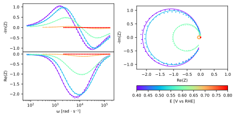

Follow up example, fitting with a model equation
================================================

This example demonstrates how to use the EZ module to fit a custom
mathematical equation to an impedance vs angular frequency response,
measured experimentally at different applied bias. In this example
intensity modulated photocurrent spectroscopy (IMPS) data is used.
Before reading this page please consult the `previous
example <EIS.html>`__ showcasing in details the use of the classes and
methods used here. The only difference herein is the different model
definition, using an equation instead of an equivalent circuit (we note
that the equation presented in this example can also be fitted with an
equivalent circuit composed of two RC circuits in series).

Model equation definition and evaluation
~~~~~~~~~~~~~~~~~~~~~~~~~~~~~~~~~~~~~~~~

A model equation is defined using the **Equation** class. This class is
initialized using a string describing the equation:

.. code:: ipython3

    from EZ.model import Equation
    
    J_bulk = r"J_e/(1+(1j*omega*tau_e))"
    J_surf = r"J_r/(1+(1j*omega*tau_r))"
    expression = fr"{J_bulk} + {J_surf}"
    model = Equation(expression)

After its definition the equation can be printed using its **print**
method:

.. code:: ipython3

    model.print()

.. math::

    \displaystyle \rm Z(\omega) = \frac{J_{e}}{i \omega \tau_{e} + 1} + \frac{J_{r}}{i \omega \tau_{r} + 1}

An evaluation of the model equation impedance vs angular frequency
response can be plotted using the **plot** method, in a similar fashion
to the `model equivalent circuit presented in the EIS
example <EIS.html#EC-eval>`__. Passing a **partial_models** argument
also leads to a similar overlay. This argument in this case is a list of
strings describing the partial equations. We use it here to display the
surface and bulk contributions of the electrode to the impedance
response.

.. code:: ipython3

    pars = {
        "J_e":   dict(value = -0.3),
        "J_r":   dict(value = 0.2),
        "tau_e": dict(value = 2e-4),
        "tau_r": dict(value = 2e-3)
    }
    model.plot(
        partial_models=[J_bulk, J_surf],
        pars=pars,
        range_omega=[1e1, 1e6]
    )

.. image:: IMPS_files/IMPS_8_0.svg
  :align: center

Loading, plotting, fitting and displaying fit results
~~~~~~~~~~~~~~~~~~~~~~~~~~~~~~~~~~~~~~~~~~~~~~~~~~~~~

We use the same procedure as the one described in the `previous
example <EIS.html#load-plot>`__. We first load the IMPS data in an
object of class **Dataset** and fit it using its **fit** method, passing
the model equation we declared in the above section via the **model**
argument of this method. The results are then displayed and exported,
using the **plot** and **export_result** methods. The resulting exported
file can be consulted
`here <https://github.com/flboudoire/EZ/blob/master/examples/data/IMPS%20CFO%20pH14%20-%20fit%20results>`__.

.. code:: ipython3

    from EZ.data import Dataset
    
    ds = Dataset(
        folder="data/IMPS CFO pH14",
        ref=("RHE", 0)
    )
    ds.fit(model, pars=pars)
    ds.plot()
    ds.export_result(show=True)

.. raw:: html

    

    
    <table border="1" class = 'docutils'>
      <thead>
        <tr style="text-align: right;">
          <th>E [V vs RHE]</th>
          <th>tau_r</th>
          <th>tau_r std</th>
          <th>J_e</th>
          <th>J_e std</th>
          <th>J_r</th>
          <th>J_r std</th>
          <th>tau_e</th>
          <th>tau_e std</th>
        </tr>
      </thead>
      <tbody>
        <tr>
          <th>0.4</th>
          <td>0.000581</td>
          <td>6.58e-06</td>
          <td>-2.42</td>
          <td>0.0131</td>
          <td>2.38</td>
          <td>0.0139</td>
          <td>3.48e-05</td>
          <td>3.56e-07</td>
        </tr>
        <tr>
          <th>0.5</th>
          <td>0.000416</td>
          <td>4.11e-06</td>
          <td>-2.3</td>
          <td>0.0114</td>
          <td>2.26</td>
          <td>0.0118</td>
          <td>2.74e-05</td>
          <td>2.48e-07</td>
        </tr>
        <tr>
          <th>0.6</th>
          <td>0.000332</td>
          <td>4.25e-06</td>
          <td>-1.16</td>
          <td>0.00741</td>
          <td>1.13</td>
          <td>0.00768</td>
          <td>2.19e-05</td>
          <td>2.58e-07</td>
        </tr>
        <tr>
          <th>0.7</th>
          <td>0.000229</td>
          <td>3.63e-06</td>
          <td>-0.135</td>
          <td>0.0012</td>
          <td>0.132</td>
          <td>0.0012</td>
          <td>2.16e-05</td>
          <td>3e-07</td>
        </tr>
        <tr>
          <th>0.8</th>
          <td>0.000151</td>
          <td>7.19e-06</td>
          <td>-0.00416</td>
          <td>0.000101</td>
          <td>0.00399</td>
          <td>9.95e-05</td>
          <td>1.57e-05</td>
          <td>5.59e-07</td>
        </tr>
      </tbody>
    </table>
    

