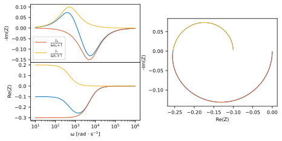

IMPS
====

Model equation definition
~~~~~~~~~~~~~~~~~~~~~~~~~

.. code:: ipython3

    from EZ.model import Equation
    
    J_bulk = r"J_e/(1+(1j*omega*tau_e))"
    J_surf = r"J_r/(1+(1j*omega*tau_r))"
    expression = fr"{J_bulk} + {J_surf}"
    model = Equation(expression)
    model.print()

.. math::

    \displaystyle \rm Z(\omega) = \frac{J_{e}}{i \omega \tau_{e} + 1} + \frac{J_{r}}{i \omega \tau_{r} + 1}

.. code:: ipython3

    pars = {
        "J_e":   dict(value = -0.3),
        "J_r":   dict(value = 0.2),
        "tau_e": dict(value = 2e-4),
        "tau_r": dict(value = 2e-3)
    }
    model.plot(
        partial_models=[J_bulk, J_surf],
        pars=pars,
        range_omega=[1e1, 1e6]
    )

Loading and plotting the IMPS data
~~~~~~~~~~~~~~~~~~~~~~~~~~~~~~~~~~

.. code:: ipython3

    from EZ.data import Dataset
    
    ds = Dataset(
        folder="data/IMPS CFO pH14",
        ref=("RHE", 0)
    )
    ds.plot()

.. image:: IMPS_files/IMPS_5_0.svg
  :align: center

Fitting and displaying fit results
~~~~~~~~~~~~~~~~~~~~~~~~~~~~~~~~~~

.. code:: ipython3

    ds.fit(model, pars=pars)
    ds.plot()

.. image:: IMPS_files/IMPS_7_0.svg
  :align: center

.. code:: ipython3

    ds.print_result()

.. raw:: html

    

    
    <table border="1" class = 'docutils'>
      <thead>
        <tr style="text-align: right;">
          <th>E [V vs RHE]</th>
          <th>J_r</th>
          <th>J_r std</th>
          <th>J_e</th>
          <th>J_e std</th>
          <th>tau_r</th>
          <th>tau_r std</th>
          <th>tau_e</th>
          <th>tau_e std</th>
        </tr>
      </thead>
      <tbody>
        <tr>
          <th>0.4</th>
          <td>2.38</td>
          <td>0.0139</td>
          <td>-2.42</td>
          <td>0.0131</td>
          <td>0.000581</td>
          <td>6.58e-06</td>
          <td>3.48e-05</td>
          <td>3.56e-07</td>
        </tr>
        <tr>
          <th>0.5</th>
          <td>2.26</td>
          <td>0.0118</td>
          <td>-2.3</td>
          <td>0.0114</td>
          <td>0.000416</td>
          <td>4.11e-06</td>
          <td>2.74e-05</td>
          <td>2.48e-07</td>
        </tr>
        <tr>
          <th>0.6</th>
          <td>1.13</td>
          <td>0.00768</td>
          <td>-1.16</td>
          <td>0.00741</td>
          <td>0.000332</td>
          <td>4.25e-06</td>
          <td>2.19e-05</td>
          <td>2.58e-07</td>
        </tr>
        <tr>
          <th>0.7</th>
          <td>0.132</td>
          <td>0.0012</td>
          <td>-0.135</td>
          <td>0.0012</td>
          <td>0.000229</td>
          <td>3.63e-06</td>
          <td>2.16e-05</td>
          <td>3e-07</td>
        </tr>
        <tr>
          <th>0.8</th>
          <td>0.00399</td>
          <td>9.95e-05</td>
          <td>-0.00416</td>
          <td>0.000101</td>
          <td>0.000151</td>
          <td>7.19e-06</td>
          <td>1.57e-05</td>
          <td>5.59e-07</td>
        </tr>
      </tbody>
    </table>
    

